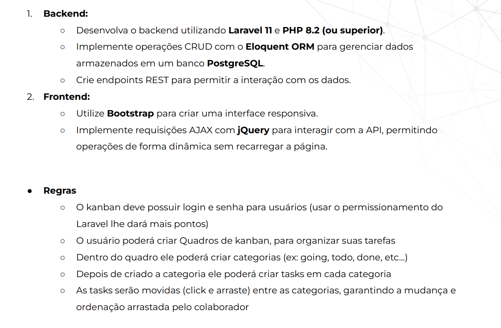

### Tecnologias uyilizadas:

-   PHP 8.2
-   Laravel 11
-   Postgresql
-   Bootstrap 5.3.6
-   jQuery 3.7.1

### Funcionalidades:

-   Sistema de autenticação com registro/login/logout e atualização de perfil;
-   Dashboard:
    -   Criação de quadros/edição/deleção/listagem/busca PAGINADA e com Ajax;
    -   Listagem resumida das 3 últimas tasks atribuídas ao usuário logado;
-   Visualização do board:

    -   Editar titulo e descrição;
    -   Adicionar/editar/deletar categorias com nome e cor;
    -   Mover posição da categoria dinamicamente;
    -   Adicionar membros para o quadro;
    -   Adicionar/deletar/editar tasks;
    -   Atribuir tasks a membros do quadro;
    -   Reordenar a task dentro da categoria com arrasta e solta;
    -   Mover a task entre as categorias com arrasta e solta;
    -   Avançar task "rápido" para a próxima categoria com um click ->.
    -   Retornar task || para categoria anterior com um click

**Confira os vídeos demonstrativos:** [Acesse aqui](https://drive.google.com/drive/folders/1XQuqhVIMJGTRdvko3Eo_6FEaq2ewtWnd?usp=sharing){:target="\_blank"}

### Instruções para servir aplicação:

-   Clone o repositório
    -                     git clone https://github.com/EdmilsonMedeiros/TaskFlow.git
-   Instale o composer
    -                     composer install
-   Copie o arquivo .env.example como .env
    -                     cp .env.example .env
-   Configure o banco de dados no arquivo .env
-   Gere a APP_KEY

    -                     php artisan key:generate

    -                     DB_CONNECTION=pgsql
                          DB_HOST=127.0.0.1
                          DB_PORT=5432
                          DB_DATABASE=postgres
                          DB_USERNAME=postgres
                          DB_PASSWORD=dev

-   Execute as migrations
    -                     php artisan migrate
-   Sirva a aplicação
    -                   php artisan serve
-   Acesse a URL na qual a aplicação foi servida, crie uma conta e pronto.
